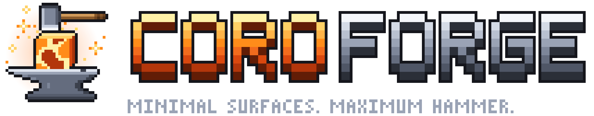
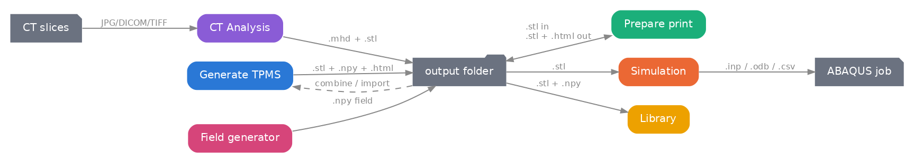

# **triply**

  *Formerly `gyroid_utils` (repo `GYROIDS`), renamed in v4.0.0: replace `import gyroid_utils` with `import triply`.*

  This is a small library to support the development of TPMS structures. Its Streamlit GUI is called **coroforge** (see [coroforge: the GUI](#coroforge-the-gui)). It is developed around three use cases, and its structure is shown below

 


# **REQUIREMENTS**
  !!!! requires Python 3.10 !!!!

  If you only want the GUI on Windows, `launcher.bat` sets up Python 3.10 for you: see [Opening the GUI](#opening-the-gui).

# **INSTALLATION**
## Core dependencies
  - Use pip to install only this library and its dependencies. 
  - It is better to first create a python 3.10 venv and then use pip install git+https://github.com/co-foucher/triply.git

```powershell
      conda create -n nameofenv python=3.10
      conda install git
      pip install git+https://github.com/co-foucher/triply.git
```
  - For changes: update the toml file and then use pip install git+https://github.com/co-foucher/triply.git

## GUI optional dependency
  - The GUI is optional, thus needs to be specifically named when installing

```powershell
      conda create -n nameofenv python=3.10
      conda install git
      pip install "triply[gui] @ git+https://github.com/co-foucher/triply.git"
```

## CUDA accelerated marching cube optional dependency
  - THIS IS NOT WORKING (YET)
  - The `gpu` extra is currently **disabled** in `pyproject.toml`: `cumcubes` needs torch already installed to build, which made `uv run` (and therefore `launcher.bat`) fail for everyone, GPU or not.
  - To try it manually, in an environment where triply is already installed:

```powershell
      pip3 install torch torchvision --index-url https://download.pytorch.org/whl/cu132
      pip install ninja
      pip install --no-build-isolation git+https://github.com/lzhnb/CuMCubes.git
```

## local installation
  - If you download the whole repository, you can then use the folder as a source for the library and make any change you want that will also take effect immediately
  - `pip install -e .` behaves the same as the git-URL install above: it only installs the core dependencies. To also install the optional GUI dependencies, use the extras syntax:

```powershell
  cd "C:\Users\PATHtoFILES"
  conda create -n nameofenv python=3.10
  conda install git
  pip install -e ".[gui]"
```

# coroforge: the GUI



**coroforge** is the [Streamlit](https://streamlit.io) app in `app/` that puts a point-and-click front end on triply. It has no pipeline logic of its own: every button calls the same TPMS / mesh / print / simulation / CT functions described in [Module Organization](#module-organization). It runs as a small local server on your own computer, and you use it in your web browser.

## Opening the GUI

### Option 1: double-click `launcher.bat` (Windows, no Python or terminal needed)
1. Get the repository: on GitHub click **Code > Download ZIP** and extract it, or `git clone https://github.com/co-foucher/triply.git`.
2. Double-click **`launcher.bat`** in the repository root.
3. A console window opens, titled *coroforge - keep this window open while you use the app*. It:
   - installs [uv](https://docs.astral.sh/uv/) for your user account if it is missing (no admin rights needed);
   - pre-answers Streamlit's one-time "Email:" question, so the first launch does not sit silently waiting for keyboard input;
   - runs `uv run --extra gui streamlit run app\Home.py`, which creates a `.venv` folder next to the launcher with Python 3.10 and the exact package versions pinned in `uv.lock`, then starts the app.
4. The app opens in your browser at http://localhost:8501, on the **Home** page.

Good to know:
  - The **first launch downloads about 450 MB and can take several minutes**. Later launches start in seconds. An internet connection is needed the first time, and again whenever `pyproject.toml` or `uv.lock` change.
  - **Keep the console window open** while you use the app: closing it stops the app. Closing the browser tab does not.
  - If something goes wrong, the window stays open with a message: *uv could not be installed* means the internet connection or proxy blocked the download; *The app has stopped* means the reason is in the messages printed above it.

### Option 2: from your own Python environment
Install the `gui` extra (see [GUI optional dependency](#gui-optional-dependency)), then run from the repository root:

```powershell
      streamlit run app/Home.py
```

or, if you use uv, without creating an environment yourself:

```powershell
      uv run --extra gui streamlit run app/Home.py
```

  - The app opens at http://localhost:8501. If Streamlit asks for an email on its very first run, just press Enter.
  - Stop the app with `Ctrl+C` in the terminal.

## Using the GUI: start from the Home page
The app opens on the **Home** page, which is the map of everything coroforge does. Each page in the sidebar is one stage of the workflow, and the pages chain together through files in the **output folder**: an `.stl` exported on one page is what the next one asks you to select.

### How the pages fit together
The Home page draws the workflow as a diagram:



Coloured boxes are pages, grey ones are the files they hand to each other. The dashed edge is *Generate TPMS* reading a mesh or field back in, to gyroid-fill an existing part or to pick up where a previous export left off.

### Pages
Below the diagram, the Home page has one card per page: what it does, the files it reads (**in**) and the files it writes (**out**). Click a card's title, or the page name in the sidebar, to open it.

| Page | What you can do | In | Out |
|---|---|---|---|
| **Generate TPMS** | Nine built-in surfaces or a custom equation, three density-field modes, baseplates and boolean combine, with live field and mesh previews. | nothing, or an `.stl` / `.npy` to combine | `.stl`, `.npy`, `.html` |
| **Prepare print** | Voxelize a mesh, label its overhangs, bridges and needed supports, search the print orientation that needs the least of them, and export the mesh rotated into it. | `.stl` | `.stl`, `.html` |
| **Simulation** | Tet-mesh with fTetWild, build and run an ABAQUS job (frequency or static stiffness), then pull the displacement fields back out. | `.stl` | `.inp`, `.odb`, `.csv` |
| **CT Analysis** | Stack JPG / DICOM / TIFF slices into one volume, build a segmentation pipeline over it, and extract a mesh from the result. | image slices, or an existing `.mhd` | `.mhd`, `.stl` |
| **Library** | Browse the output folder: preview each structure and download its mesh, its saved field files and its saved preview. | the output folder | downloads |

### "How this works" panels
Every page except the Library opens with a collapsed **How this works** panel that walks through its pipeline step by step, one column per section of the page. Start there if a parameter isn't obvious: the panels explain what each section is actually doing, not just what the widget is called.

| Page | Pipeline explained in its panel |
|---|---|
| Generate TPMS | implicit field -> density field -> marching cubes |
| Prepare print | voxelize -> overhang labels -> orientation search |
| Simulation | STL -> tet mesh -> ABAQUS input -> results |
| CT Analysis | slices -> volume -> mask -> mesh |

### Sidebar (on every page)
  - **Output folder**: where every page writes its files and reads them from. It defaults to `app/gui_outputs/` and is created if it doesn't exist. Change it to work in another folder; it applies to the current browser session, and the **Library** page lists whatever is in it.
  - **Select Log Level**: how much of triply's own logging is printed in the console window (DEBUG, INFO, WARNING, ERROR, CRITICAL; default INFO).

### What some pages need besides Python
  - **Simulation** needs [fTetWild](https://github.com/wildmeshing/fTetWild) (the path to its executable is set on the page; default `C:\Program Files\fTetWild\build\Release\FloatTetwild_bin.exe`) and a local **ABAQUS** installation whose `abaqus` command works in a terminal. Meshing and ABAQUS runs happen in the background, and their status and log are shown on the page and refresh on their own.
  - **CT Analysis** shows a static slice preview in the browser. Its full interactive viewer opens as a separate desktop window.
  - The **Browse...** buttons open your operating system's own file and folder dialogs. This works because the app runs on your own computer.

# Known Bugs
Coordinates in the STL mesh do not match exactly the definition in the matrix. This is due to the marching cube algorithm, resulting in structure about a pixel larger in every dimension.

# Module Organization
The library is organized around three main use cases:

## TPMS structure generation
This is used to generate TPMS structures (especially gyroids) using the general workflow below:

note that it was originaly designed for creating gyroid, but not limited to them.

All TPMS model code now lives under the **`TPMS_classes/`** subpackage (`src/triply/TPMS_classes/`), which re-exports everything so `from triply.TPMS_classes import GyroidModel` (etc.) works without reaching into individual files.

Scripts related to this use case:
- **TPMS_classes/tpms_base.py**: Shared `TPMSModel` base class — field computation, meshing, export, previews, quality checks, and baseplates. Every TPMS type is a thin subclass that only supplies its implicit surface equation.
- **TPMS_classes/tpms_gyroid.py**: `GyroidModel` + `create_a_gyroid()`
- **TPMS_classes/tpms_schwartzp.py**: `SchwartzPModel` + `create_a_schwartz_p()`
- **TPMS_classes/tpms_diamond.py**: `DiamondModel` + `create_a_diamond()`
- **TPMS_classes/tpms_iwp.py**: `IWPModel` + `create_a_iwp()`
- **TPMS_classes/tpms_neovius.py**: `NeoviusModel` + `create_a_neovius()`
- **TPMS_classes/tpms_fischerkochs.py**: `FischerKochSModel` + `create_a_fischer_koch_s()`
- **TPMS_classes/tpms_frd.py**: `FRDModel` + `create_a_frd()`
- **TPMS_classes/tpms_lidinoid.py**: `LidinoidModel` + `create_a_lidinoid()`
- **TPMS_classes/tpms_splitp.py**: `SplitPModel` + `create_a_split_p()`
- **mesh_tools.py**: Mesh processing functions (simplification, smoothing, fixing, validation, export), plus `matrix_from_mesh()` (voxelize a mesh back into a filled 3D grid — the inverse of `mesh_from_matrix`) and `auto_smooth_mesh()` (runs Taubin smoothing in batches and stops automatically once a roughness metric plateaus, instead of a hand-picked iteration count)
- **io_ops.py**: Input/output operations (STL loading/saving, .npz archives)
- **viz.py**: Visualization tools (HTML previews, histograms, 2D matrix views)
- **voxel_tools.py**: Print-readiness tools for a solid/empty voxel grid:
  - `detect_overhangs()`: flags voxels whose overhang angle (relative to the build plate, along z) exceeds a threshold (default 45°), and recognizes safe bridges (span supported from both sides) as distinct from true overhangs.
  - `find_optimal_orientation()`: samples build directions over a sphere and returns the reoriented grid with the fewest overhangs/bridges — an automatic "best way to print this" search.
  - Support for optional automatic support-voxel insertion under unsupported overhangs (`add_support_voxels`, still marked experimental in the code).

All nine TPMS types (gyroid, Schwartz P, Diamond, I-WP, Neovius, Fischer-Koch S, F-RD, Lidinoid, Split-P) share the exact same API since they all subclass `TPMSModel` — swap the import/class name and everything else in the Quick Start example below works unchanged.

Example notebooks for this use case:
- **Gyroids_STL.ipynb**
- **Gyroids_STL_class.ipynb**
- **overhang_test.ipynb**: demos overhang detection and build-orientation search

## Simulation of STL file
This is used to be able to create simulations of the generated structures. More specifically, to create a tetrahedral mesh adapted to finite element modeling using FtetWild, manipulate them, create ABAQUS input files, and run them in batches. Example use case in the image below is for simulating the first 10 natural frequencies of a simple gyroid.


Scripts related to this use case:
- **abaqus_tools.py**: ABAQUS simulation integration
- **TET_mesh_tools.py**: Tetrahedral mesh operations

Example notebooks for this use case:
- **full simulation workflow.ipynb**: end-to-end simulation preparation workflow
- **STL_to_inp_ftetwild.ipynb**: how to use fTetWild to transform a STL to an ABAQUS input file (inp)

## Analysis of CT scans
This is used to help analyse CT scan of structures.

Scripts related to this use case:
- **CT_scans.py**: CT data readers and preprocessing helpers, including `convert_jpg_to_mhd()` to stack a folder (or glob pattern) of JPG slice images into a single .mhd volume
- **CT_visualization_window.py**: CT visualization tooling

Example notebooks for this use case:
- **CT_scan_processing.ipynb**: CT-to-mesh pipeline and interactive mesh coloring (including curvature mode)

## library tools and configuration
Other scripts exist for configuring this library and some useful functions
- **logger.py**: Logging configuration
- **config.py**: Shared constants and default tolerances used across the library
- **utils.py**: Low-level helpers (e.g. `reload_all()` for interactive development)


# FEATURES

## TPMS Structure Generation
- Nine TPMS surface types out of the box: Gyroid, Schwartz P, Diamond, I-WP, Neovius, Fischer-Koch S, F-RD, Lidinoid, and Split-P, all sharing one `TPMSModel` base class/API
- Three field computation modes: `'abs'`, `'signed'`, and `'distance'`/`'distance_fast'` for flexible wall definition
- Support for variable periods and thickness (scalar or per-voxel arrays)
- Optional baseplates for structural support
- Overhang/print-readiness check on the voxel grid (`voxel_tools.detect_overhangs()`), flagging voxels beyond a configurable overhang angle (default 45°) while recognizing safe two-sided bridges
- Automatic build-orientation search (`find_optimal_orientation()`) that reorients the grid to minimize overhangs/bridges

## Surface Mesh Processing
- Marching cubes algorithm for isosurface extraction
- Mesh voxelization back into a filled 3D grid (`matrix_from_mesh()`), the inverse of the marching-cubes step
- Three mesh simplification backends: `'pyvista'` (decimate_pro), `'trimesh'` (vertex clustering, default), or `'open3d'` (quadric decimation) — note that `mesh_tools.simplify_mesh()` and other low-level mesh_tools functions now consistently take/return `(verts, faces)`, not `(faces, verts)`
- Mesh smoothing with Humphrey filter, plus an auto-stopping variant (`auto_smooth_mesh()`) that smooths in batches until a roughness metric plateaus
- Automatic mesh repair (non-manifold edges, hole filling)
- Comprehensive mesh validation (watertight, manifold, self-intersections)
- Interactive HTML previews with Plotly, with different color scheme: constant, random, normal, curvature.
- Triangle area analysis and visualization
- Robust STL import/export (Open3D and numpy-stl backends)

## Tetrahedral Meshing
- Seamless integration with [fTetWild](https://github.com/wildmeshing/fTetWild) for high-quality mesh generation
- Tetrahedral mesh manipulation and refinement tools

## ABAQUS Simulation
- Automated frequency analysis simulations
- Full DSS (Dynamic Substructuring) simulations
- Batch simulation file generation and management

## CT Scan Analysis
- CT data reading and preprocessing, including converting a folder of JPG slice images into a .mhd volume
- Interactive visualization window for CT scans
- Mesh coloring and analysis (including curvature visualization)

## Utilities
- Compressed field data storage (.npz format)
- Configurable logging (DEBUG, INFO, WARNING, ERROR, CRITICAL)
- Module reload functionality for interactive development


# Quick Start: Creating a Gyroid
The `GyroidModel` class is the main entry point for gyroid generation. The typical workflow is:

1. Create a coordinate grid
2. Instantiate `GyroidModel` with your grid and parameters
3. Compute the scalar field
4. Generate and simplify mesh
5. Export as STL

### Simple Example

```python
import numpy as np
from triply.TPMS_classes import GyroidModel

# Create a 64×64×64 grid
x, y, z = np.meshgrid(np.linspace(0,1,64),
                      np.linspace(0,1,64),
                      np.linspace(0,1,64), indexing='ij')

# Initialize model
model = GyroidModel(x, y, z, px=1.0, py=1.0, pz=1.0, thickness=0.2)

# Build scalar field (choose 'abs', 'signed', or 'distance')
model.compute_field(mode='distance')

# Generate mesh from isosurface
verts, faces = model.generate_mesh()

# Simplify, smooth, and repair
model.simplify_mesh(target_faces=10000, mode='trimesh')
model.smooth_mesh(smoothing_factor=0.5)
model.fix_mesh()

# Export
model.export_stl("my_gyroid.stl")
model.save("gyroid_data.npz")  # Save field for later
```

Any other TPMS type works the same way — just import a different class, e.g. `from triply.TPMS_classes import DiamondModel`.

### All-in-One Function

For a quicker workflow, use `create_a_gyroid()`:

```python
import numpy as np
from triply.TPMS_classes import create_a_gyroid

x, y, z = np.meshgrid(np.linspace(0,10,128),
                      np.linspace(0,10,128),
                      np.linspace(0,20,256), indexing='ij')

create_a_gyroid(
    x, y, z,
    px=2.0, py=2.0, pz=2.0,
    t=1.0,
    save_path="my_gyroid",
    baseplate_thickness=2.0,
    step_size=2,
    simplification_factor=0.8
)
```

For more detailed API documentation and parameters, see [tpms_base.py](src/triply/TPMS_classes/tpms_base.py) (shared pipeline) and [tpms_gyroid.py](src/triply/TPMS_classes/tpms_gyroid.py) (gyroid-specific equation), or check out the example notebooks.


# Logging
Control logging verbosity:

```python
import triply
triply.set_log_level("DEBUG")  # or "INFO", "WARNING", "ERROR", "CRITICAL"
```

# License
This project is licensed under EMPA. See the `license` field in `pyproject.toml`.


